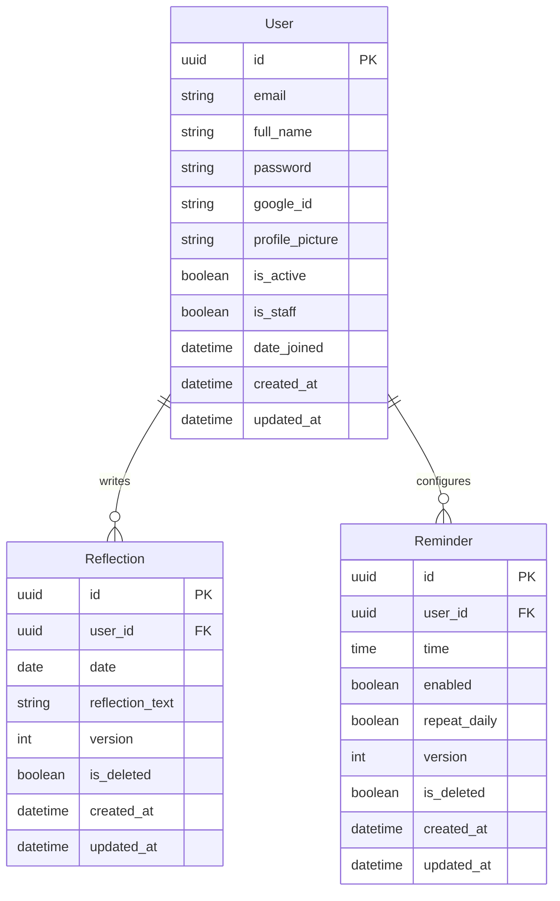

# Resolve Backend - API Services

Resolve is an offline-first self-improvement mobile application. This backend provides production-ready REST APIs for synchronization, user profile management, daily reflections, history tracking, calendars, dynamic streaks/statistics computation, reminders, and data exports (JSON, CSV, PDF).

---

## System Architecture

```mermaid
graph TD
    subgraph Client Application (React Native)
        SQLite[(SQLite DB)] <--> ClientApp[Mobile App UI]
        ClientApp <--> SyncEngine[Sync Coordinator]
    end

    subgraph Backend Services (Django REST Framework)
        SyncEngine <-- HTTPS / JSON --> ApiRouter[API Gateway / Router]
        ApiRouter --> AuthMiddleware[JWT / Google OAuth Middleware]
        AuthMiddleware --> ServiceLayer[Service Classes]
        
        subgraph Business Logic Layer
            ServiceLayer --> SyncService[Sync Engine]
            ServiceLayer --> StreakService[Streak/Stats Engine]
            ServiceLayer --> ExportService[Export Engine]
        end

        ServiceLayer --> ORM[Django ORM]
    end

    subgraph Data Stores
        ORM <--> PostgreSQL[(PostgreSQL DB)]
    end
```

---

## Database ER Diagram



---

## Features & Implementation

1. **Clean Architecture**: Decoupled views, serializers, and models using a dedicated **Service Layer** for all business operations.
2. **Dynamic Metrics**: User streaks (current/longest) and completion rates are computed dynamically using optimized SQL via Django ORM. No redundant state tracking.
3. **Robust Sync Engine**: Uses version numbers and manual `updated_at` checks for client-server database conflict resolution. Supports additions, modifications, and soft deletions.
4. **Security Hardening**:
   - UUID primary keys to mask internal database IDs.
   - Argon2 password hashing algorithm.
   - JWT tokens with short-lived access lifespans and token rotation + blacklisting on refresh/logout.
   - Custom Security Headers Middleware.
   - Rate throttling limits for anonymous and authenticated traffic.

---

## Getting Started

### Prerequisites
- Python 3.11+
- PostgreSQL 12+

### Installation & Setup

1. **Clone the Repository** and navigate to the backend folder:
   ```bash
   cd backend/
   ```

2. **Create a Virtual Environment**:
   ```bash
   python3.11 -m venv .venv
   source .venv/bin/activate
   ```

3. **Install Dependencies**:
   ```bash
   pip install -r requirements.txt
   ```

4. **Environment Configuration**:
   Create a `.env` file in the root of the `backend/` directory:
   ```ini
   SECRET_KEY=your-django-secret-key
   DEBUG=True
   ALLOWED_HOSTS=localhost,127.0.0.1
   DATABASE_URL=postgres://<username>:<password>@localhost:5432/<database_name>
   GOOGLE_OAUTH_CLIENT_ID=your-google-oauth-client-id
   GOOGLE_OAUTH_CLIENT_SECRET=your-google-oauth-client-secret
   ```

5. **Run Migrations**:
   ```bash
   python manage.py migrate
   ```

6. **Create a Superuser**:
   ```bash
   python manage.py createsuperuser
   ```

7. **Start the Development Server**:
   ```bash
   python manage.py runserver
   ```

---

## API Endpoints List

Interactive API documentation (Swagger) is available locally at:
`http://127.0.0.1:8000/api/schema/swagger-ui/`

### 1. Authentication (`/auth/`)
- `POST /auth/register/` - Create a new user account.
- `POST /auth/login/` - Authenticate with email/password and receive JWT tokens.
- `POST /auth/google/` - Exchange Google OAuth token for JWT tokens.
- `POST /auth/refresh/` - Renew expired access tokens.
- `POST /auth/logout/` - Blacklist refresh tokens.

### 2. User Profile (`/profile/`)
- `GET /profile/` - Fetch profile metadata.
- `PUT /profile/` - Update profile picture and full name.

### 3. Reflections (`/reflection/`)
- `GET /reflection/today/` - Retrieve today's reflection (404 if not yet recorded).
- `POST /reflection/` - Record a daily reflection.
- `PUT /reflection/{uuid}/` - Modify a reflection text.
- `DELETE /reflection/{uuid}/` - Soft-delete a reflection.

### 4. History & Calendar (`/history/` & `/calendar/`)
- `GET /history/` - Retrieve paginated historical reflections (supports search, date filter, ordering).
- `GET /history/search/` - Filter/search history records.
- `GET /calendar/` - Returns list of dates containing reflections for calendar markers.

### 5. Statistics (`/statistics/`)
- `GET /statistics/` - Dynamic computations for current streak, longest streak, total counts, and completion rates.

### 6. Reminders (`/reminder/`)
- `GET /reminder/` - Read user notification configuration.
- `PUT /reminder/` - Update notification times and repeat schedules.

### 7. Sync Engine (`/sync/`)
- `POST /sync/` - Conflict-free offline sync gateway.

### 8. Data Exports (`/export/`)
- `GET /export/json/` - Raw data backup in JSON format.
- `GET /export/csv/` - Reflections download in CSV format.
- `GET /export/pdf/` - Styled, downloadable report in PDF format.

---

## Running Tests

To run the unit, model, and integration tests:
```bash
python manage.py test apps.users.tests apps.authentication.tests apps.reflections.tests apps.sync.tests
```
